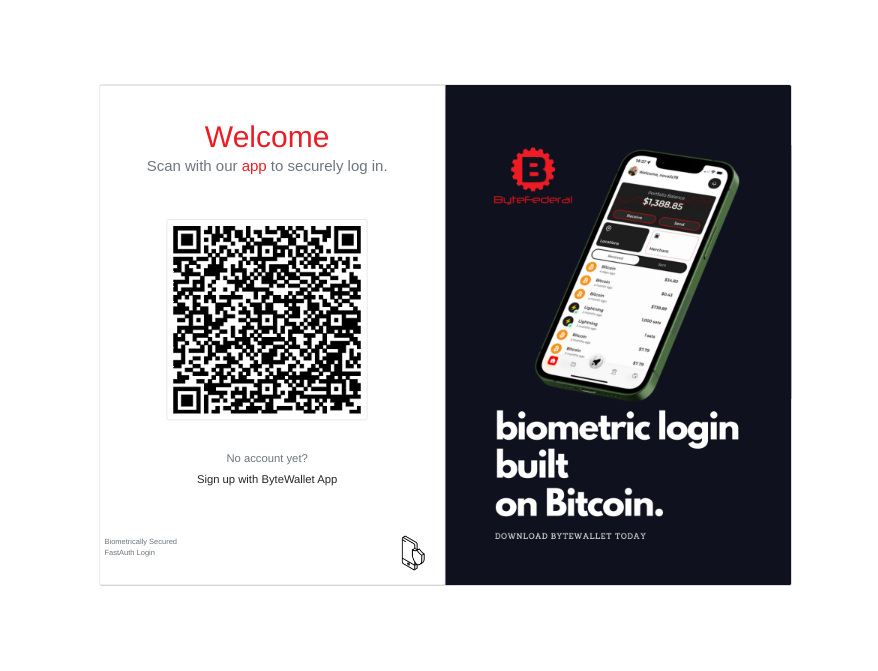

# ByteAuth NextJS



## Introduction

ByteAuth NextJS is a plug-and-play NextJS package that integrates Byte Federal's fast authentication system into your application, leveraging Bitcoin cryptographic (ECDSA/SHA256) standards. This advanced authentication solution offers a seamless way to onboard users and enable secure sign-in functionalities, similar to the WebAuthn standard, but with several groundbreaking features:

- **Enhanced Security**: Cryptographic keys are backed up for added security
- **Device Independence**: Operates independently of the user's operating system, using a smartphone as a universal access key
- **Identity Verification**: Incorporates a user identity check to thwart fraudulent access including a liveness check to verify the presence of real human beings during authentication
- **Wallet Functionality**: Provides users with a wallet that supports Lightning and Bitcoin transactions, enhancing the overall user experience (LNUrl, micropayments, etc.)

By integrating ByteAuth NextJS, you can easily implement a state-of-the-art, comprehensive authentication system in your NextJS projects, harnessing the robustness and security of Bitcoin's cryptographic infrastructure.

## Philosophy & Reasoning

### Why Passwordless Authentication?

Traditional password-based authentication suffers from numerous limitations:

1. **Security Vulnerabilities**: Passwords can be weak, reused, or stolen
2. **User Experience Issues**: Users forget passwords, leading to frustrating recovery processes
3. **Management Overhead**: Password management systems add complexity and cost

ByteAuth leverages public-private key cryptography and biometric verification to create a more secure and user-friendly authentication experience. Users never have to remember a password, lose a password, or worry about username theft.

### Why Crypto Wallets?

Crypto wallets provide several advantages as authentication devices:

1. **Cryptographic Security**: Built on Bitcoin's battle-tested cryptographic standards
2. **Biometric Protection**: Modern smartphone wallets require biometric verification
3. **Universal Access**: Works across multiple devices and platforms
4. **Recovery Options**: Private keys can be backed up securely
5. **Additional Functionality**: Enables crypto transactions and other web3 features

## Features

- **Two Integration Modes**:
  - **Tab Mode**: Adds a crypto wallet authentication tab to existing login forms
  - **Standalone Mode**: Creates a dedicated crypto wallet authentication page
- **QR Code Authentication**: Simple scanning process for users
- **NextAuth.js Integration**: Works alongside NextAuth.js for comprehensive authentication options
- **Webhook Support**: Handles registration and login callbacks from ByteAuth servers
- **Responsive Design**: Works on mobile and desktop devices
- **Typescript Support**: Fully typed for better developer experience
- **Session Management**: Integrates with NextAuth's session system

## Installation

```bash
npm install byteauth-nextjs
# or
yarn add byteauth-nextjs
```

### Dependencies

ByteAuth NextJS requires the following dependencies:

```json
{
  "next": "^14.0.0",
  "next-auth": "^4.24.5",
  "react": "^18.2.0",
  "react-dom": "^18.2.0",
  "qrcode.react": "^3.1.0",
  "axios": "^1.6.2",
  "zustand": "^4.4.6"
}
```

Most of these should already be in your NextJS project. If not, install any missing dependencies:

```bash
npm install next-auth qrcode.react axios zustand
# or
yarn add next-auth qrcode.react axios zustand
```

## Getting Started

### 1. Configuration

Create an environment file (`.env.local`) with your ByteAuth configuration:

```
NEXT_PUBLIC_BYTEAUTH_DOMAIN=your-domain.com
BYTEAUTH_API_KEY=your-api-key
NEXT_PUBLIC_BYTEAUTH_HOME_REDIRECT=/dashboard
```

### 2. Register Your Domain

Register your domain in the API section [on ByteFederal](https://wallet.bytefederal.com/web/login) to get your API key.

### 3. Add API Endpoints

Create the necessary API endpoints in your NextJS application. You can copy these files from the package's source:

```
pages/api/byteauth/webhook/registration.ts
pages/api/byteauth/webhook/login.ts
pages/api/byteauth/check.ts
pages/api/auth/[...nextauth].ts
```

For session storage, we recommend using Redis. Install the Redis client:

```bash
npm install redis
# or
yarn add redis
```

Update the mock functions in the API endpoints to use Redis:

```typescript
// Example Redis implementation for storing authenticated SIDs
import { createClient } from 'redis';

const redis = createClient({
  url: process.env.REDIS_URL
});

async function storeAuthenticatedSid(sid: string, userId: string): Promise<void> {
  await redis.connect();
  await redis.set(`authenticated_sid_${sid}`, userId, {
    EX: 600 // 10 minutes expiry
  });
  await redis.disconnect();
}
```

### 4. Set Up NextAuth.js

Configure NextAuth.js to work with ByteAuth by updating `pages/api/auth/[...nextauth].ts`:

```typescript
import NextAuth, { NextAuthOptions } from 'next-auth';
import CredentialsProvider from 'next-auth/providers/credentials';

export const authOptions: NextAuthOptions = {
  providers: [
    CredentialsProvider({
      // ... ByteAuth credential configuration
    }),
    // Add other providers as needed
  ],
  // ... rest of NextAuth config
};

export default NextAuth(authOptions);
```

### 5. Implement the UI Components

#### Tab Mode (alongside existing login form)

```jsx
import { ByteAuth } from 'byteauth-nextjs';

const LoginPage = () => {
  return (
    <div className="login-page">
      <h1>Sign In</h1>
      
      {/* This adds a tab interface with both Email and Crypto Wallet options */}
      <ByteAuth 
        mode="tab" 
        onAuthSuccess={(user) => {
          console.log('User authenticated:', user);
          // Redirect or update UI
        }} 
      />
      
      {/* Your existing email login form remains visible when the Email tab is selected */}
      <form>
        {/* Your existing email login form fields */}
      </form>
    </div>
  );
};
```

#### Standalone Mode (dedicated crypto login page)

```jsx
import { ByteAuth } from 'byteauth-nextjs';

const CryptoLoginPage = () => {
  return (
    <div className="crypto-login-page">
      <h1>Sign In with ByteWallet</h1>
      
      {/* This shows only the QR code for ByteWallet authentication */}
      <ByteAuth 
        mode="standalone" 
        onAuthSuccess={(user) => {
          console.log('User authenticated:', user);
          // Redirect or update UI
        }} 
      />
    </div>
  );
};
```

## How It Works

### Authentication Flow

1. **QR Code Generation**:
   - When the login page loads, ByteAuth generates a unique session ID (SID)
   - A QR code containing this SID is displayed to the user

2. **User Authentication**:
   - User scans the QR code with their ByteWallet app
   - ByteWallet verifies the user's identity with biometrics
   - User approves the authentication request

3. **Server Validation**:
   - ByteAuth server calls your webhook endpoints with the user information
   - Your application verifies the SID against the ByteAuth API
   - Your application creates or finds the user in your database

4. **Session Establishment**:
   - Your application stores the authenticated SID with the user ID
   - The frontend polls the server to check if the SID has been authenticated
   - When authenticated, the user is redirected to the dashboard or home page

### Component Architecture

```
ByteAuth NextJS
├── components/
│   ├── ByteAuth.tsx - Main component with tab and standalone modes
│   └── QRLogin.tsx - Handles QR code generation and display
├── hooks/
│   ├── useByteAuth.ts - Custom hook for authentication process
│   └── useByteAuthStore.ts - State management using Zustand
├── config/
│   └── byteauth.ts - Configuration for API endpoints
└── pages/api/byteauth/ - API endpoints for authentication
    ├── webhook/
    │   ├── registration.ts - Handles user registration
    │   └── login.ts - Handles user login
    ├── check.ts - Checks authentication status
    └── auth.ts - Handles authentication redirection
```

## Advanced Usage

### Custom Styling

You can customize the appearance of the ByteAuth components by providing custom CSS:

```jsx
<ByteAuth
  mode="standalone"
  onAuthSuccess={handleAuthSuccess}
  className="my-custom-byteauth"
/>
```

Then define your custom styles:

```css
.my-custom-byteauth .byteauth-qrcode-container {
  background-color: #f0f0f0;
  border-radius: 16px;
  padding: 24px;
}
```

### Handling Authentication Events

```jsx
import { useByteAuth } from 'byteauth-nextjs';

const LoginPage = () => {
  const { 
    isAuthenticated, 
    user, 
    loading, 
    error, 
    checkAuthStatus 
  } = useByteAuth({
    redirectOnAuth: true,
    redirectPath: '/dashboard',
    pollingInterval: 3000, // Check every 3 seconds
  });

  // Custom event handling
  React.useEffect(() => {
    if (isAuthenticated) {
      // Custom logic when authenticated
      console.log('User authenticated:', user);
      analytics.track('User Login', { method: 'ByteAuth' });
    }
  }, [isAuthenticated, user]);

  return (
    <div>
      {/* Your login UI */}
    </div>
  );
};
```

### Integration with Existing Auth Systems

ByteAuth can work alongside your existing authentication system:

```jsx
import { useSession } from 'next-auth/react';
import { ByteAuth, useByteAuth } from 'byteauth-nextjs';

const LoginPage = () => {
  const { data: session } = useSession();
  const { isAuthenticated: isByteAuthenticated } = useByteAuth();

  // Check either authentication method
  const isAuthenticated = session || isByteAuthenticated;

  if (isAuthenticated) {
    // User is authenticated via either method
    return <redirect to="/dashboard" />;
  }

  return (
    <div>
      {/* Traditional login form */}
      <form>...</form>
      
      {/* Or ByteAuth */}
      <div className="byteauth-section">
        <h3>Or login with your crypto wallet</h3>
        <ByteAuth mode="standalone" />
      </div>
    </div>
  );
};
```

## Security Considerations

ByteAuth uses Bitcoin's cryptographic standards (ECDSA/SHA256) for authentication, providing a high level of security. However, proper implementation is crucial:

1. **API Key Security**: Keep your ByteAuth API key secure and never expose it to the client
2. **HTTPS Required**: Always use HTTPS for all endpoints
3. **Session Validation**: Always verify session integrity with the ByteAuth API
4. **SID Storage**: Use secure storage like Redis with appropriate TTL for SIDs
5. **CORS Configuration**: Configure CORS correctly for your webhook endpoints

## Troubleshooting

### QR Code Not Displaying

Make sure your environment variables are correctly set:

```
NEXT_PUBLIC_BYTEAUTH_DOMAIN=your-domain.com
BYTEAUTH_API_KEY=your-api-key
```

### Authentication Not Working

1. Check your API endpoints are correctly set up
2. Verify your domain is registered with ByteAuth
3. Check server logs for any errors in the webhook endpoints
4. Ensure Redis or your chosen session storage is working correctly

### ByteWallet App Issues

Make sure users have the latest version of the ByteWallet app installed from:
- [iOS App Store](https://apps.apple.com/us/app/bytewallet/id1569062610)
- [Google Play Store](https://play.google.com/store/apps/details?id=io.bytewallet.bytewallet)

## Implementation Complexity

The implementation complexity of ByteAuth NextJS can be broken down as follows:

### Frontend Components (Low-Medium Complexity)
- QR code generation and display
- Tab interface for integration with existing forms
- Polling mechanism for authentication status checks

### API Endpoints (Medium Complexity)
- Webhook handlers for registration and login
- Session verification and management
- Integration with NextAuth.js

### Session Storage (Medium Complexity)
- Redis or similar storage for SIDs
- Secure session management
- Proper expiration and cleanup

### User Management (Varies)
- Integration with your existing user database
- User creation and lookup logic
- Session establishment with your auth system

The overall implementation is designed to be as straightforward as possible, with most of the cryptographic complexity handled by the ByteAuth server and ByteWallet app.

## Future Development

- **Multi-language Support**: Add internationalization for the UI components
- **Advanced Theming**: Enhanced customization options
- **Analytics Integration**: Built-in tracking for authentication events
- **Multi-tenant Support**: For applications serving multiple domains
- **Server-side Rendering Optimizations**: For improved performance

## Learn More

- [Learn more about ByteAuth / Fast Login](https://fast.bytefederal.com)
- [Learn more about ByteWallet](https://www.bytefederal.com/bytewallet)
- [ByteAuth API Documentation](https://fast.bytefederal.com/docs)

## Support

For support with ByteAuth NextJS:
- [GitHub Issues](https://github.com/bytefederal/byteauth-nextjs/issues)
- [Email Support](mailto:support@bytefederal.com)

## License

ByteAuth NextJS is open-sourced software licensed under the MIT license.
